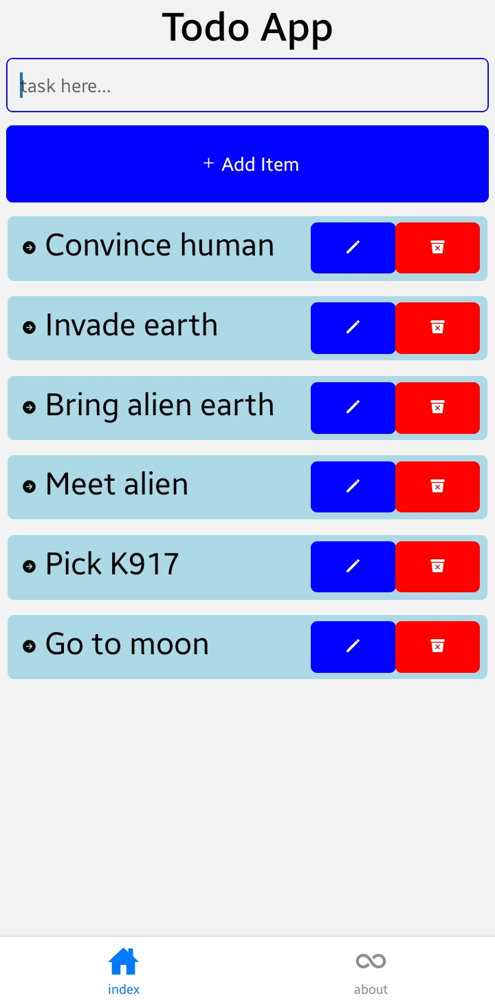

# ToDo App with Supabase  

A simple and efficient ToDo application built with **React Native** and powered by **Supabase** as the backend.  

## Features  

- [x] Add, edit, and delete tasks  
- [x] Organize tasks with categories (optional, if applicable)  
- [x] Secure authentication (if implemented)  
- [x] Real-time sync with Supabase  
- [x] Cross-platform (iOS & Android)  

## Technologies Used  

- **Frontend:** React Native (Expo)  
- **Backend:** Supabase (PostgreSQL + Realtime API)  
- **Navigation:** React Navigation  
- **Styling:** StyleSheet 
## Setup & Installation  

1. **Clone the repository**  
   ```sh
   git clone https://github.com/KISHOREkevin/todoapp-react-native.git todoapp
   cd todoapp/
   ```
2. **Install dependencies**
    ```sh
    npm install
    ```
3. **Set up Supabase**
    - Create a project on Supabase
    - create .env 
    - paste this 
      ```
      EXPO_PUBLIC_SUPABASE_URL=<your-supabase-url>
      EXPO_PUBLIC_SUPABASE_KEY=<your-supabase-key>
      ```
4. Run the App
    ```sh
    npx expo start
    ```

## ScreenShot
 

## Contributions

This project was made possible thanks to:
- The React Native community
- Supabase for the backend
- Open-source libraries & tools

Feel free to contribute by opening issues or pull requests!

## License
MIT © Kishore Kevin
